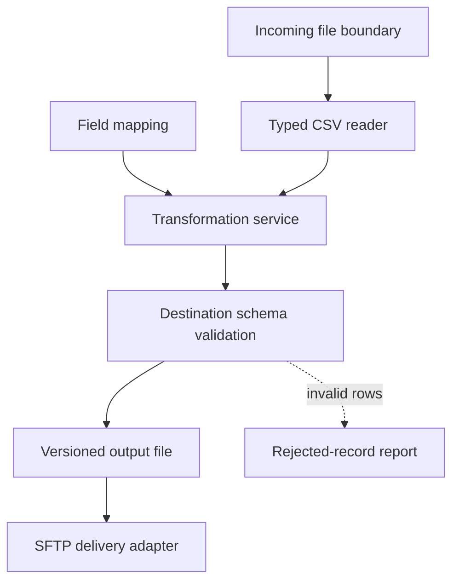

# Architecture

```mermaid
flowchart TB
    IN[Incoming file boundary] --> READ[Typed CSV reader]
    MAP[Field mapping] --> TRANSFORM[Transformation service]
    READ --> TRANSFORM
    TRANSFORM --> VALIDATE[Destination schema validation]
    VALIDATE --> OUT[Versioned output file]
    OUT --> SFTP[SFTP delivery adapter]
    VALIDATE -. invalid rows .-> ERR[Rejected-record report]
```

The transformation service is independent of transport. Mapping rules are versioned separately from credentials so schema changes can be reviewed without exposing access material.
